# Classification (Computer Vision)

## Load Necessary Library


```python
import cv2 as cv
import matplotlib.pyplot as plt
import numpy as np
from sklearn.datasets import load_digits
```

## Load MNIST Digits Dataset From Scikit-Learn Dataset


```python
digits = load_digits(as_frame=True)
```

### Show Sample Data

Keterangan mengenai fungsi **load_digits()** dapat dilihat pada link dibawah
> https://scikit-learn.org/stable/modules/generated/sklearn.datasets.load_digits.html

#### Menampilkan deskripsi dataset


```python
from IPython.display import display, HTML
display(HTML(digits.DESCR))
```


.. _digits_dataset:

Optical recognition of handwritten digits dataset
--------------------------------------------------

**Data Set Characteristics:**

    :Number of Instances: 1797
    :Number of Attributes: 64
    :Attribute Information: 8x8 image of integer pixels in the range 0..16.
    :Missing Attribute Values: None
    :Creator: E. Alpaydin (alpaydin '@' boun.edu.tr)
    :Date: July; 1998

This is a copy of the test set of the UCI ML hand-written digits datasets
https://archive.ics.uci.edu/ml/datasets/Optical+Recognition+of+Handwritten+Digits

The data set contains images of hand-written digits: 10 classes where
each class refers to a digit.

Preprocessing programs made available by NIST were used to extract
normalized bitmaps of handwritten digits from a preprinted form. From a
total of 43 people, 30 contributed to the training set and different 13
to the test set. 32x32 bitmaps are divided into nonoverlapping blocks of
4x4 and the number of on pixels are counted in each block. This generates
an input matrix of 8x8 where each element is an integer in the range
0..16. This reduces dimensionality and gives invariance to small
distortions.

For info on NIST preprocessing routines, see M. D. Garris, J. L. Blue, G.
T. Candela, D. L. Dimmick, J. Geist, P. J. Grother, S. A. Janet, and C.
L. Wilson, NIST Form-Based Handprint Recognition System, NISTIR 5469,
1994.

.. topic:: References

  - C. Kaynak (1995) Methods of Combining Multiple Classifiers and Their
    Applications to Handwritten Digit Recognition, MSc Thesis, Institute of
    Graduate Studies in Science and Engineering, Bogazici University.
  - E. Alpaydin, C. Kaynak (1998) Cascading Classifiers, Kybernetika.
  - Ken Tang and Ponnuthurai N. Suganthan and Xi Yao and A. Kai Qin.
    Linear dimensionalityreduction using relevance weighted LDA. School of
    Electrical and Electronic Engineering Nanyang Technological University.
    2005.
  - Claudio Gentile. A New Approximate Maximal Margin Classification
    Algorithm. NIPS. 2000.


#### Menampilkan data saja


```python
digits.data
```


<div>
<style scoped>
    .dataframe tbody tr th:only-of-type {
        vertical-align: middle;
    }

    .dataframe tbody tr th {
        vertical-align: top;
    }

    .dataframe thead th {
        text-align: right;
    }
</style>
<table border="1" class="dataframe">
  <thead>
    <tr style="text-align: right;">
      <th></th>
      <th>pixel_0_0</th>
      <th>pixel_0_1</th>
      <th>pixel_0_2</th>
      <th>pixel_0_3</th>
      <th>pixel_0_4</th>
      <th>pixel_0_5</th>
      <th>pixel_0_6</th>
      <th>pixel_0_7</th>
      <th>pixel_1_0</th>
      <th>pixel_1_1</th>
      <th>...</th>
      <th>pixel_6_6</th>
      <th>pixel_6_7</th>
      <th>pixel_7_0</th>
      <th>pixel_7_1</th>
      <th>pixel_7_2</th>
      <th>pixel_7_3</th>
      <th>pixel_7_4</th>
      <th>pixel_7_5</th>
      <th>pixel_7_6</th>
      <th>pixel_7_7</th>
    </tr>
  </thead>
  <tbody>
    <tr>
      <th>0</th>
      <td>0.0</td>
      <td>0.0</td>
      <td>5.0</td>
      <td>13.0</td>
      <td>9.0</td>
      <td>1.0</td>
      <td>0.0</td>
      <td>0.0</td>
      <td>0.0</td>
      <td>0.0</td>
      <td>...</td>
      <td>0.0</td>
      <td>0.0</td>
      <td>0.0</td>
      <td>0.0</td>
      <td>6.0</td>
      <td>13.0</td>
      <td>10.0</td>
      <td>0.0</td>
      <td>0.0</td>
      <td>0.0</td>
    </tr>
    <tr>
      <th>1</th>
      <td>0.0</td>
      <td>0.0</td>
      <td>0.0</td>
      <td>12.0</td>
      <td>13.0</td>
      <td>5.0</td>
      <td>0.0</td>
      <td>0.0</td>
      <td>0.0</td>
      <td>0.0</td>
      <td>...</td>
      <td>0.0</td>
      <td>0.0</td>
      <td>0.0</td>
      <td>0.0</td>
      <td>0.0</td>
      <td>11.0</td>
      <td>16.0</td>
      <td>10.0</td>
      <td>0.0</td>
      <td>0.0</td>
    </tr>
    <tr>
      <th>2</th>
      <td>0.0</td>
      <td>0.0</td>
      <td>0.0</td>
      <td>4.0</td>
      <td>15.0</td>
      <td>12.0</td>
      <td>0.0</td>
      <td>0.0</td>
      <td>0.0</td>
      <td>0.0</td>
      <td>...</td>
      <td>5.0</td>
      <td>0.0</td>
      <td>0.0</td>
      <td>0.0</td>
      <td>0.0</td>
      <td>3.0</td>
      <td>11.0</td>
      <td>16.0</td>
      <td>9.0</td>
      <td>0.0</td>
    </tr>
    <tr>
      <th>3</th>
      <td>0.0</td>
      <td>0.0</td>
      <td>7.0</td>
      <td>15.0</td>
      <td>13.0</td>
      <td>1.0</td>
      <td>0.0</td>
      <td>0.0</td>
      <td>0.0</td>
      <td>8.0</td>
      <td>...</td>
      <td>9.0</td>
      <td>0.0</td>
      <td>0.0</td>
      <td>0.0</td>
      <td>7.0</td>
      <td>13.0</td>
      <td>13.0</td>
      <td>9.0</td>
      <td>0.0</td>
      <td>0.0</td>
    </tr>
    <tr>
      <th>4</th>
      <td>0.0</td>
      <td>0.0</td>
      <td>0.0</td>
      <td>1.0</td>
      <td>11.0</td>
      <td>0.0</td>
      <td>0.0</td>
      <td>0.0</td>
      <td>0.0</td>
      <td>0.0</td>
      <td>...</td>
      <td>0.0</td>
      <td>0.0</td>
      <td>0.0</td>
      <td>0.0</td>
      <td>0.0</td>
      <td>2.0</td>
      <td>16.0</td>
      <td>4.0</td>
      <td>0.0</td>
      <td>0.0</td>
    </tr>
    <tr>
      <th>...</th>
      <td>...</td>
      <td>...</td>
      <td>...</td>
      <td>...</td>
      <td>...</td>
      <td>...</td>
      <td>...</td>
      <td>...</td>
      <td>...</td>
      <td>...</td>
      <td>...</td>
      <td>...</td>
      <td>...</td>
      <td>...</td>
      <td>...</td>
      <td>...</td>
      <td>...</td>
      <td>...</td>
      <td>...</td>
      <td>...</td>
      <td>...</td>
    </tr>
    <tr>
      <th>1792</th>
      <td>0.0</td>
      <td>0.0</td>
      <td>4.0</td>
      <td>10.0</td>
      <td>13.0</td>
      <td>6.0</td>
      <td>0.0</td>
      <td>0.0</td>
      <td>0.0</td>
      <td>1.0</td>
      <td>...</td>
      <td>4.0</td>
      <td>0.0</td>
      <td>0.0</td>
      <td>0.0</td>
      <td>2.0</td>
      <td>14.0</td>
      <td>15.0</td>
      <td>9.0</td>
      <td>0.0</td>
      <td>0.0</td>
    </tr>
    <tr>
      <th>1793</th>
      <td>0.0</td>
      <td>0.0</td>
      <td>6.0</td>
      <td>16.0</td>
      <td>13.0</td>
      <td>11.0</td>
      <td>1.0</td>
      <td>0.0</td>
      <td>0.0</td>
      <td>0.0</td>
      <td>...</td>
      <td>1.0</td>
      <td>0.0</td>
      <td>0.0</td>
      <td>0.0</td>
      <td>6.0</td>
      <td>16.0</td>
      <td>14.0</td>
      <td>6.0</td>
      <td>0.0</td>
      <td>0.0</td>
    </tr>
    <tr>
      <th>1794</th>
      <td>0.0</td>
      <td>0.0</td>
      <td>1.0</td>
      <td>11.0</td>
      <td>15.0</td>
      <td>1.0</td>
      <td>0.0</td>
      <td>0.0</td>
      <td>0.0</td>
      <td>0.0</td>
      <td>...</td>
      <td>0.0</td>
      <td>0.0</td>
      <td>0.0</td>
      <td>0.0</td>
      <td>2.0</td>
      <td>9.0</td>
      <td>13.0</td>
      <td>6.0</td>
      <td>0.0</td>
      <td>0.0</td>
    </tr>
    <tr>
      <th>1795</th>
      <td>0.0</td>
      <td>0.0</td>
      <td>2.0</td>
      <td>10.0</td>
      <td>7.0</td>
      <td>0.0</td>
      <td>0.0</td>
      <td>0.0</td>
      <td>0.0</td>
      <td>0.0</td>
      <td>...</td>
      <td>2.0</td>
      <td>0.0</td>
      <td>0.0</td>
      <td>0.0</td>
      <td>5.0</td>
      <td>12.0</td>
      <td>16.0</td>
      <td>12.0</td>
      <td>0.0</td>
      <td>0.0</td>
    </tr>
    <tr>
      <th>1796</th>
      <td>0.0</td>
      <td>0.0</td>
      <td>10.0</td>
      <td>14.0</td>
      <td>8.0</td>
      <td>1.0</td>
      <td>0.0</td>
      <td>0.0</td>
      <td>0.0</td>
      <td>2.0</td>
      <td>...</td>
      <td>8.0</td>
      <td>0.0</td>
      <td>0.0</td>
      <td>1.0</td>
      <td>8.0</td>
      <td>12.0</td>
      <td>14.0</td>
      <td>12.0</td>
      <td>1.0</td>
      <td>0.0</td>
    </tr>
  </tbody>
</table>
<p>1797 rows × 64 columns</p>
</div>


#### Menampilkan kelas data saja


```python
digits.target
```


    0       0
    1       1
    2       2
    3       3
    4       4
           ..
    1792    9
    1793    0
    1794    8
    1795    9
    1796    8
    Name: target, Length: 1797, dtype: int64


#### Menampilkan nama fitur


```python
digits.feature_names
```


    ['pixel_0_0',
     'pixel_0_1',
     'pixel_0_2',
     'pixel_0_3',
     'pixel_0_4',
     'pixel_0_5',
     'pixel_0_6',
     'pixel_0_7',
     'pixel_1_0',
     'pixel_1_1',
     'pixel_1_2',
     'pixel_1_3',
     'pixel_1_4',
     'pixel_1_5',
     'pixel_1_6',
     'pixel_1_7',
     'pixel_2_0',
     'pixel_2_1',
     'pixel_2_2',
     'pixel_2_3',
     'pixel_2_4',
     'pixel_2_5',
     'pixel_2_6',
     'pixel_2_7',
     'pixel_3_0',
     'pixel_3_1',
     'pixel_3_2',
     'pixel_3_3',
     'pixel_3_4',
     'pixel_3_5',
     'pixel_3_6',
     'pixel_3_7',
     'pixel_4_0',
     'pixel_4_1',
     'pixel_4_2',
     'pixel_4_3',
     'pixel_4_4',
     'pixel_4_5',
     'pixel_4_6',
     'pixel_4_7',
     'pixel_5_0',
     'pixel_5_1',
     'pixel_5_2',
     'pixel_5_3',
     'pixel_5_4',
     'pixel_5_5',
     'pixel_5_6',
     'pixel_5_7',
     'pixel_6_0',
     'pixel_6_1',
     'pixel_6_2',
     'pixel_6_3',
     'pixel_6_4',
     'pixel_6_5',
     'pixel_6_6',
     'pixel_6_7',
     'pixel_7_0',
     'pixel_7_1',
     'pixel_7_2',
     'pixel_7_3',
     'pixel_7_4',
     'pixel_7_5',
     'pixel_7_6',
     'pixel_7_7']


#### Menampilkan kelas data


```python
digits.target_names
```


    array([0, 1, 2, 3, 4, 5, 6, 7, 8, 9])


#### Menampilkan data dan kelas dalam bentuk dataframe


```python
digits.frame
```


<div>
<style scoped>
    .dataframe tbody tr th:only-of-type {
        vertical-align: middle;
    }

    .dataframe tbody tr th {
        vertical-align: top;
    }

    .dataframe thead th {
        text-align: right;
    }
</style>
<table border="1" class="dataframe">
  <thead>
    <tr style="text-align: right;">
      <th></th>
      <th>pixel_0_0</th>
      <th>pixel_0_1</th>
      <th>pixel_0_2</th>
      <th>pixel_0_3</th>
      <th>pixel_0_4</th>
      <th>pixel_0_5</th>
      <th>pixel_0_6</th>
      <th>pixel_0_7</th>
      <th>pixel_1_0</th>
      <th>pixel_1_1</th>
      <th>...</th>
      <th>pixel_6_7</th>
      <th>pixel_7_0</th>
      <th>pixel_7_1</th>
      <th>pixel_7_2</th>
      <th>pixel_7_3</th>
      <th>pixel_7_4</th>
      <th>pixel_7_5</th>
      <th>pixel_7_6</th>
      <th>pixel_7_7</th>
      <th>target</th>
    </tr>
  </thead>
  <tbody>
    <tr>
      <th>0</th>
      <td>0.0</td>
      <td>0.0</td>
      <td>5.0</td>
      <td>13.0</td>
      <td>9.0</td>
      <td>1.0</td>
      <td>0.0</td>
      <td>0.0</td>
      <td>0.0</td>
      <td>0.0</td>
      <td>...</td>
      <td>0.0</td>
      <td>0.0</td>
      <td>0.0</td>
      <td>6.0</td>
      <td>13.0</td>
      <td>10.0</td>
      <td>0.0</td>
      <td>0.0</td>
      <td>0.0</td>
      <td>0</td>
    </tr>
    <tr>
      <th>1</th>
      <td>0.0</td>
      <td>0.0</td>
      <td>0.0</td>
      <td>12.0</td>
      <td>13.0</td>
      <td>5.0</td>
      <td>0.0</td>
      <td>0.0</td>
      <td>0.0</td>
      <td>0.0</td>
      <td>...</td>
      <td>0.0</td>
      <td>0.0</td>
      <td>0.0</td>
      <td>0.0</td>
      <td>11.0</td>
      <td>16.0</td>
      <td>10.0</td>
      <td>0.0</td>
      <td>0.0</td>
      <td>1</td>
    </tr>
    <tr>
      <th>2</th>
      <td>0.0</td>
      <td>0.0</td>
      <td>0.0</td>
      <td>4.0</td>
      <td>15.0</td>
      <td>12.0</td>
      <td>0.0</td>
      <td>0.0</td>
      <td>0.0</td>
      <td>0.0</td>
      <td>...</td>
      <td>0.0</td>
      <td>0.0</td>
      <td>0.0</td>
      <td>0.0</td>
      <td>3.0</td>
      <td>11.0</td>
      <td>16.0</td>
      <td>9.0</td>
      <td>0.0</td>
      <td>2</td>
    </tr>
    <tr>
      <th>3</th>
      <td>0.0</td>
      <td>0.0</td>
      <td>7.0</td>
      <td>15.0</td>
      <td>13.0</td>
      <td>1.0</td>
      <td>0.0</td>
      <td>0.0</td>
      <td>0.0</td>
      <td>8.0</td>
      <td>...</td>
      <td>0.0</td>
      <td>0.0</td>
      <td>0.0</td>
      <td>7.0</td>
      <td>13.0</td>
      <td>13.0</td>
      <td>9.0</td>
      <td>0.0</td>
      <td>0.0</td>
      <td>3</td>
    </tr>
    <tr>
      <th>4</th>
      <td>0.0</td>
      <td>0.0</td>
      <td>0.0</td>
      <td>1.0</td>
      <td>11.0</td>
      <td>0.0</td>
      <td>0.0</td>
      <td>0.0</td>
      <td>0.0</td>
      <td>0.0</td>
      <td>...</td>
      <td>0.0</td>
      <td>0.0</td>
      <td>0.0</td>
      <td>0.0</td>
      <td>2.0</td>
      <td>16.0</td>
      <td>4.0</td>
      <td>0.0</td>
      <td>0.0</td>
      <td>4</td>
    </tr>
    <tr>
      <th>...</th>
      <td>...</td>
      <td>...</td>
      <td>...</td>
      <td>...</td>
      <td>...</td>
      <td>...</td>
      <td>...</td>
      <td>...</td>
      <td>...</td>
      <td>...</td>
      <td>...</td>
      <td>...</td>
      <td>...</td>
      <td>...</td>
      <td>...</td>
      <td>...</td>
      <td>...</td>
      <td>...</td>
      <td>...</td>
      <td>...</td>
      <td>...</td>
    </tr>
    <tr>
      <th>1792</th>
      <td>0.0</td>
      <td>0.0</td>
      <td>4.0</td>
      <td>10.0</td>
      <td>13.0</td>
      <td>6.0</td>
      <td>0.0</td>
      <td>0.0</td>
      <td>0.0</td>
      <td>1.0</td>
      <td>...</td>
      <td>0.0</td>
      <td>0.0</td>
      <td>0.0</td>
      <td>2.0</td>
      <td>14.0</td>
      <td>15.0</td>
      <td>9.0</td>
      <td>0.0</td>
      <td>0.0</td>
      <td>9</td>
    </tr>
    <tr>
      <th>1793</th>
      <td>0.0</td>
      <td>0.0</td>
      <td>6.0</td>
      <td>16.0</td>
      <td>13.0</td>
      <td>11.0</td>
      <td>1.0</td>
      <td>0.0</td>
      <td>0.0</td>
      <td>0.0</td>
      <td>...</td>
      <td>0.0</td>
      <td>0.0</td>
      <td>0.0</td>
      <td>6.0</td>
      <td>16.0</td>
      <td>14.0</td>
      <td>6.0</td>
      <td>0.0</td>
      <td>0.0</td>
      <td>0</td>
    </tr>
    <tr>
      <th>1794</th>
      <td>0.0</td>
      <td>0.0</td>
      <td>1.0</td>
      <td>11.0</td>
      <td>15.0</td>
      <td>1.0</td>
      <td>0.0</td>
      <td>0.0</td>
      <td>0.0</td>
      <td>0.0</td>
      <td>...</td>
      <td>0.0</td>
      <td>0.0</td>
      <td>0.0</td>
      <td>2.0</td>
      <td>9.0</td>
      <td>13.0</td>
      <td>6.0</td>
      <td>0.0</td>
      <td>0.0</td>
      <td>8</td>
    </tr>
    <tr>
      <th>1795</th>
      <td>0.0</td>
      <td>0.0</td>
      <td>2.0</td>
      <td>10.0</td>
      <td>7.0</td>
      <td>0.0</td>
      <td>0.0</td>
      <td>0.0</td>
      <td>0.0</td>
      <td>0.0</td>
      <td>...</td>
      <td>0.0</td>
      <td>0.0</td>
      <td>0.0</td>
      <td>5.0</td>
      <td>12.0</td>
      <td>16.0</td>
      <td>12.0</td>
      <td>0.0</td>
      <td>0.0</td>
      <td>9</td>
    </tr>
    <tr>
      <th>1796</th>
      <td>0.0</td>
      <td>0.0</td>
      <td>10.0</td>
      <td>14.0</td>
      <td>8.0</td>
      <td>1.0</td>
      <td>0.0</td>
      <td>0.0</td>
      <td>0.0</td>
      <td>2.0</td>
      <td>...</td>
      <td>0.0</td>
      <td>0.0</td>
      <td>1.0</td>
      <td>8.0</td>
      <td>12.0</td>
      <td>14.0</td>
      <td>12.0</td>
      <td>1.0</td>
      <td>0.0</td>
      <td>8</td>
    </tr>
  </tbody>
</table>
<p>1797 rows × 65 columns</p>
</div>


#### Menampilkan data dalam bentuk gambar


```python
import numpy as np

counter = 1
for idx, data in enumerate(digits.images[0:10]):
    plt.subplot(1, 10, idx+1)
    plt.imshow(data, cmap='gray')
```


    
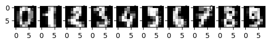
    


## Fitur Pada Citra

### Geometri

>Sebagai contoh pada dataset digit, bentuk angka dapat dijadikan fitur dengan cara melihat pola nilai pada masing-masing pixel.
>Setiap citra pada dataset MNIST Digits memiliki dimensi 8x8. Agar dapat digunakan dalam proses klasifikasi maka citra akan diubah dimensinya menjadi 1x64.
>Sebagai gambaran mengenai bentuk citra ketika diubah dimensinya dapat dilihat pada gambar dibawah.


```python
import numpy as np

plt.figure(figsize=(10,10))
counter = 1
for idx, data in enumerate(digits.images[0:10]):
    plt.subplot(10, 1, idx+1)
    plt.title('Digit '+str(idx))
    img = np.expand_dims(data.flatten(), axis=0)
    plt.imshow(img, cmap='gray')
```


    
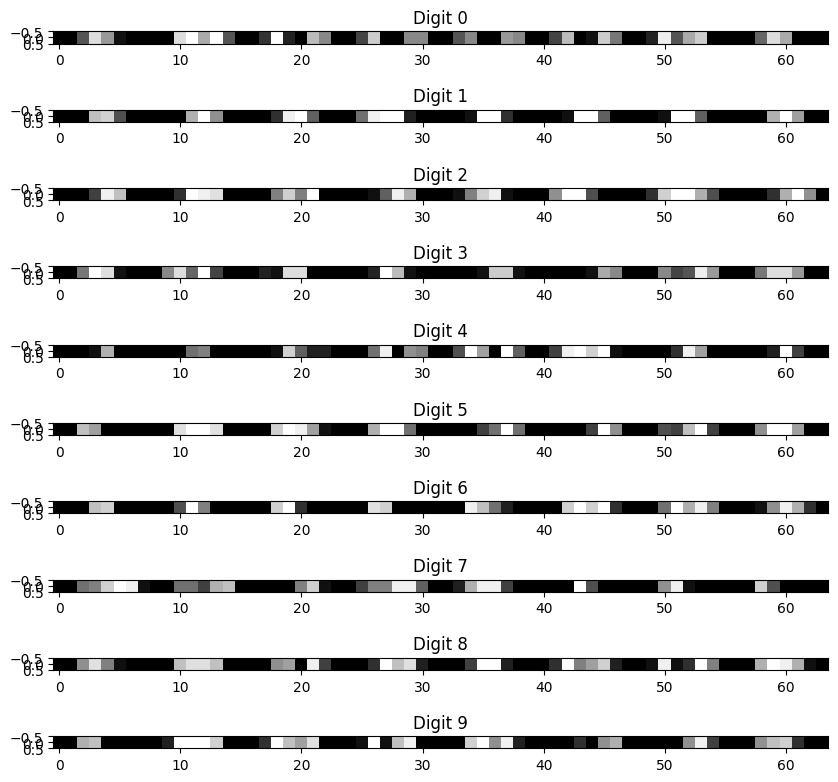
    


#### Splitting Dataset

##### Hold-out

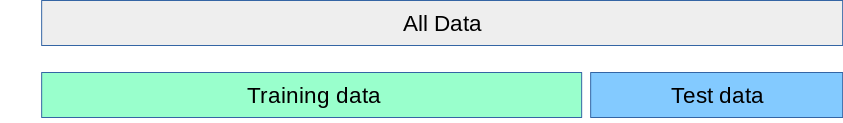


```python
from sklearn.model_selection import train_test_split

digits_frame = digits.frame
x = digits_frame.iloc[:,:-1]
y = digits_frame.iloc[:,-1]
x_train, x_test, y_train, y_test = train_test_split(x, y, train_size=0.7, random_state=99, shuffle=True)
```


```python
from sklearn.tree import DecisionTreeClassifier

clf = DecisionTreeClassifier()
clf.fit(x_train, y_train)
y_predict = clf.predict(x_test)
y_predict
```


    array([7, 8, 0, 5, 3, 5, 9, 6, 1, 8, 4, 6, 5, 0, 7, 0, 9, 4, 3, 3, 5, 9,
           0, 6, 5, 1, 4, 0, 2, 1, 3, 8, 5, 2, 0, 9, 7, 6, 4, 4, 2, 5, 3, 8,
           3, 6, 7, 8, 7, 7, 3, 8, 3, 0, 3, 1, 9, 9, 3, 2, 3, 7, 2, 6, 3, 7,
           1, 2, 4, 6, 5, 2, 7, 1, 2, 2, 0, 5, 3, 9, 7, 9, 6, 7, 6, 3, 5, 7,
           7, 6, 7, 7, 8, 6, 7, 1, 0, 1, 0, 8, 6, 4, 1, 1, 9, 0, 4, 1, 1, 3,
           8, 6, 1, 8, 5, 8, 0, 8, 7, 7, 3, 6, 9, 3, 6, 4, 6, 3, 7, 5, 9, 3,
           9, 9, 3, 1, 6, 8, 6, 4, 2, 3, 7, 9, 7, 8, 0, 6, 2, 6, 7, 9, 8, 2,
           9, 3, 2, 2, 8, 0, 8, 5, 9, 8, 7, 2, 5, 0, 8, 1, 0, 6, 2, 2, 8, 1,
           7, 7, 1, 2, 2, 9, 6, 5, 5, 1, 9, 9, 9, 5, 1, 6, 9, 4, 0, 5, 2, 8,
           0, 6, 1, 6, 1, 2, 8, 0, 1, 6, 5, 8, 3, 0, 7, 7, 2, 5, 7, 7, 3, 4,
           2, 6, 6, 2, 4, 6, 8, 5, 0, 9, 2, 7, 4, 9, 8, 7, 0, 1, 3, 2, 5, 9,
           1, 9, 0, 4, 0, 4, 4, 3, 4, 0, 0, 1, 6, 7, 8, 9, 7, 5, 6, 7, 5, 7,
           5, 5, 7, 1, 5, 8, 0, 7, 0, 3, 2, 4, 3, 2, 6, 8, 7, 1, 9, 1, 1, 6,
           4, 5, 1, 6, 5, 3, 7, 6, 2, 3, 0, 2, 9, 5, 8, 2, 7, 2, 5, 8, 9, 7,
           2, 2, 4, 2, 2, 9, 6, 5, 0, 9, 8, 7, 0, 6, 4, 2, 4, 7, 6, 3, 0, 3,
           4, 5, 2, 5, 7, 0, 2, 8, 2, 7, 2, 5, 8, 3, 1, 0, 3, 6, 3, 1, 8, 6,
           3, 0, 5, 3, 3, 0, 4, 6, 9, 4, 4, 8, 6, 1, 7, 7, 7, 5, 4, 1, 3, 7,
           4, 6, 8, 1, 1, 2, 3, 0, 0, 6, 9, 7, 4, 7, 2, 3, 6, 5, 1, 5, 9, 4,
           2, 3, 7, 1, 1, 7, 8, 1, 5, 6, 5, 3, 0, 6, 1, 8, 8, 9, 7, 8, 4, 1,
           1, 8, 0, 2, 5, 5, 6, 3, 4, 0, 5, 8, 5, 8, 7, 3, 9, 0, 2, 8, 2, 5,
           9, 8, 2, 0, 6, 1, 3, 8, 1, 8, 9, 6, 1, 3, 6, 2, 0, 9, 0, 2, 2, 3,
           7, 5, 9, 9, 7, 5, 1, 2, 4, 7, 8, 6, 4, 8, 1, 4, 5, 4, 9, 7, 9, 9,
           4, 3, 3, 2, 7, 2, 9, 3, 5, 0, 6, 2, 2, 8, 1, 0, 1, 6, 1, 9, 2, 1,
           7, 4, 1, 8, 4, 5, 3, 5, 7, 1, 2, 1, 2, 0, 3, 3, 2, 5, 1, 6, 6, 6,
           0, 7, 2, 9, 0, 8, 6, 9, 0, 5, 3, 6])


##### Confusion Matrix


```python
from sklearn.metrics import confusion_matrix

cm = confusion_matrix(y_test, y_predict)
cm
```


    array([[49,  0,  0,  0,  1,  1,  0,  0,  1,  0],
           [ 0, 37,  1,  0,  1,  0,  0,  0,  7,  2],
           [ 0,  3, 54,  0,  0,  1,  0,  1,  3,  0],
           [ 0,  1,  2, 47,  0,  1,  0,  2,  2,  4],
           [ 0,  2,  1,  0, 34,  0,  4,  3,  0,  0],
           [ 0,  2,  0,  1,  2, 46,  1,  0,  0,  0],
           [ 0,  1,  2,  0,  0,  1, 54,  0,  0,  0],
           [ 0,  3,  0,  1,  1,  1,  0, 51,  2,  2],
           [ 1,  5,  1,  3,  0,  2,  0,  3, 37,  1],
           [ 1,  2,  0,  3,  1,  1,  0,  3,  0, 40]])


##### Accuracy


```python
from sklearn.metrics import accuracy_score
print('Accuracy:', round(accuracy_score(y_test, y_predict)*100,2),'%')
```

    Accuracy: 83.15 %


##### Precision


```python
from sklearn.metrics import precision_score

precisions = precision_score(y_test, y_predict, average=None)
print('======= Precision =========')
for i in digits.target_names:
    percentage = round(precisions[i],2)*100
    print('Digit-',i,': ',percentage,'%')
```

    ======= Precision =========
    Digit- 0 :  96.0 %
    Digit- 1 :  66.0 %
    Digit- 2 :  89.0 %
    Digit- 3 :  85.0 %
    Digit- 4 :  85.0 %
    Digit- 5 :  85.0 %
    Digit- 6 :  92.0 %
    Digit- 7 :  81.0 %
    Digit- 8 :  71.0 %
    Digit- 9 :  82.0 %


##### Recall


```python
from sklearn.metrics import recall_score

recalls = recall_score(y_test, y_predict, average=None)
print('======= Recall =========')
for i in digits.target_names:
    percentage = round(recalls[i],2)*100
    print('Digit-',i,': ',percentage,'%')
```

    ======= Recall =========
    Digit- 0 :  94.0 %
    Digit- 1 :  77.0 %
    Digit- 2 :  87.0 %
    Digit- 3 :  80.0 %
    Digit- 4 :  77.0 %
    Digit- 5 :  88.0 %
    Digit- 6 :  93.0 %
    Digit- 7 :  84.0 %
    Digit- 8 :  70.0 %
    Digit- 9 :  78.0 %


##### F1 Score


```python
from sklearn.metrics import f1_score

f1 = f1_score(y_test, y_predict, average=None)
print('======= F1 Score =========')
for i in digits.target_names:
    percentage = round(f1[i],2)*100
    print('Digit-',i,': ',percentage,'%')
```

    ======= F1 Score =========
    Digit- 0 :  95.0 %
    Digit- 1 :  71.0 %
    Digit- 2 :  88.0 %
    Digit- 3 :  82.0 %
    Digit- 4 :  81.0 %
    Digit- 5 :  87.0 %
    Digit- 6 :  92.0 %
    Digit- 7 :  82.0 %
    Digit- 8 :  70.0 %
    Digit- 9 :  80.0 %


#### Cross Validation

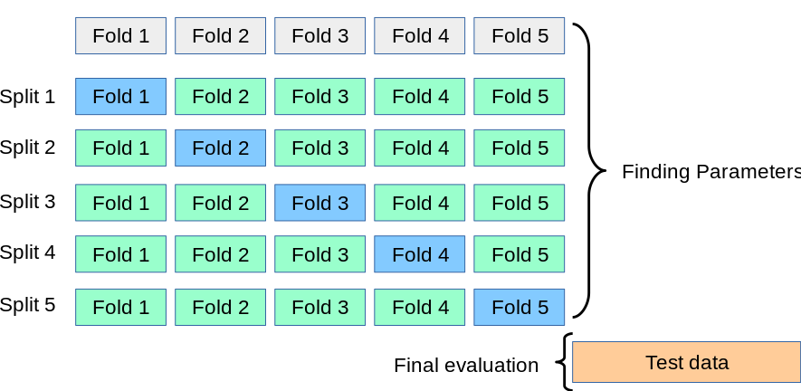


```python
from sklearn.model_selection import KFold

digits_frame = digits.frame
x = digits_frame.iloc[:,:-1]
y = digits_frame.iloc[:,-1]
kf = KFold(n_splits=5, random_state=99, shuffle=True)
kf
```


    KFold(n_splits=5, random_state=99, shuffle=True)


```python
kf.split(x, y)
```


    <generator object _BaseKFold.split at 0x127dfa960>


```python
from sklearn.metrics import accuracy_score
from statistics import mean

acc_score = []
model = DecisionTreeClassifier()
for train, test in kf.split(x):
    x_train, x_test = x.iloc[train,:], x.iloc[test,:]
    y_train, y_test = y.iloc[train], y.iloc[test]
    model.fit(x_train, y_train)
    y_predict = model.predict(x_test)
    acc_score.append(accuracy_score(y_test, y_predict))

avg_acc = mean(acc_score)
print("Accuracy: ", round(avg_acc*100,2),'%')
```

    Accuracy:  85.59 %


```python
from sklearn.model_selection import cross_validate
from sklearn.tree import DecisionTreeClassifier

model = DecisionTreeClassifier()
scores = cross_validate(model, x, y, scoring=['accuracy','f1_weighted'], cv=5)
print('Accuracy: ',round(mean(scores['test_accuracy'])*100,2),'%')
print('F1: ',round(mean(scores['test_f1_weighted'])*100,2),'%')
```

    Accuracy:  77.75 %
    F1:  77.55 %


### Fitur Warna

Dataset used is Flower Color Image
>https://www.kaggle.com/datasets/olgabelitskaya/flower-color-images/discussion

#### Preparation


```python
import pandas as pd
import matplotlib.pyplot as plt
import cv2 as cv
import numpy as np
import os
from scipy import stats

FLOWER_PATH = 'flower_images/'
```

#### Load Dataframe


```python
LABEL_PATH = os.path.join(FLOWER_PATH,'labels.csv')
flower_dataset = pd.read_csv(LABEL_PATH)
labels_name = ['phlox','rose', 'calendu', 'iris','leucanthem','campanula','viola','rudbeckia','peony','aquilegia']
flower_dataset
```


<div>
<style scoped>
    .dataframe tbody tr th:only-of-type {
        vertical-align: middle;
    }

    .dataframe tbody tr th {
        vertical-align: top;
    }

    .dataframe thead th {
        text-align: right;
    }
</style>
<table border="1" class="dataframe">
  <thead>
    <tr style="text-align: right;">
      <th></th>
      <th>file</th>
      <th>label</th>
    </tr>
  </thead>
  <tbody>
    <tr>
      <th>0</th>
      <td>0001.png</td>
      <td>0</td>
    </tr>
    <tr>
      <th>1</th>
      <td>0002.png</td>
      <td>0</td>
    </tr>
    <tr>
      <th>2</th>
      <td>0003.png</td>
      <td>2</td>
    </tr>
    <tr>
      <th>3</th>
      <td>0004.png</td>
      <td>0</td>
    </tr>
    <tr>
      <th>4</th>
      <td>0005.png</td>
      <td>0</td>
    </tr>
    <tr>
      <th>...</th>
      <td>...</td>
      <td>...</td>
    </tr>
    <tr>
      <th>205</th>
      <td>0206.png</td>
      <td>6</td>
    </tr>
    <tr>
      <th>206</th>
      <td>0207.png</td>
      <td>0</td>
    </tr>
    <tr>
      <th>207</th>
      <td>0208.png</td>
      <td>4</td>
    </tr>
    <tr>
      <th>208</th>
      <td>0209.png</td>
      <td>6</td>
    </tr>
    <tr>
      <th>209</th>
      <td>0210.png</td>
      <td>1</td>
    </tr>
  </tbody>
</table>
<p>210 rows × 2 columns</p>
</div>


#### Samples


```python
flower_dataset[flower_dataset['label']==1].head(1)['file'].to_string(index=False)
```


    '0006.png'


```python
labels = sorted(flower_dataset.loc[:, 'label'].unique())
counter = 1
for i in labels:
    plt.subplot(2, 5, counter)
    counter +=1
    img_path = os.path.join(FLOWER_PATH,'images',flower_dataset[flower_dataset['label']==i].head(1)['file'].to_string(index=False))
    img = plt.imread(img_path)
    plt.title(labels_name[i])
    plt.imshow(img)
```


    
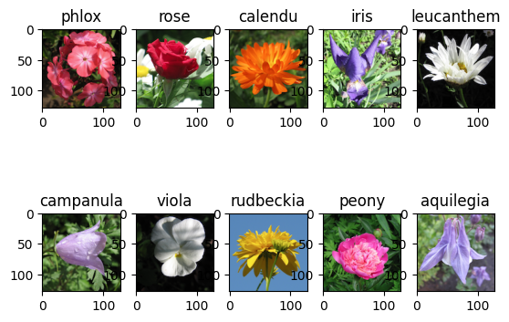
    


```python
sample_name = flower_dataset.loc[0,'file']
sample_path = os.path.join(FLOWER_PATH,'images',sample_name)
sample_img = cv.imread(sample_path)
sample_img = cv.cvtColor(sample_img, cv.COLOR_BGR2RGB)
print('Shape: ',sample_img.shape)

plt.figure(figsize=(2, 2))
plt.title('Sample Image')
plt.imshow(sample_img)
```

    Shape:  (128, 128, 3)


    <matplotlib.image.AxesImage at 0x1290b5fc0>


    
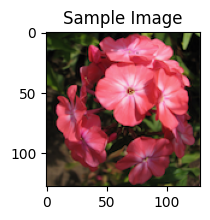
    


```python
plt.suptitle('Color Channels Illustration')

plt.subplot(2,3,1)
plt.title('Red')
red = sample_img.copy()
red[:,:,1] = 0
red[:,:,2] = 0
plt.imshow(red)

plt.subplot(2,3,2)
plt.title('Green')
green = sample_img.copy()
green[:,:,0] = 0
green[:,:,2] = 0
plt.imshow(green)

plt.subplot(2,3,3)
plt.title('Blue')
blue = sample_img.copy()
blue[:,:,0] = 0
blue[:,:,1] = 0
plt.imshow(blue)

plt.subplot(2,3,4)
plt.title('Red')
plt.imshow(sample_img[:,:,0], cmap='gray')

plt.subplot(2,3,5)
plt.title('Green')
plt.imshow(sample_img[:,:,1], cmap='gray')

plt.subplot(2,3,6)
plt.title('Blue')
plt.imshow(sample_img[:,:,2], cmap='gray')
```


    <matplotlib.image.AxesImage at 0x129239660>


    
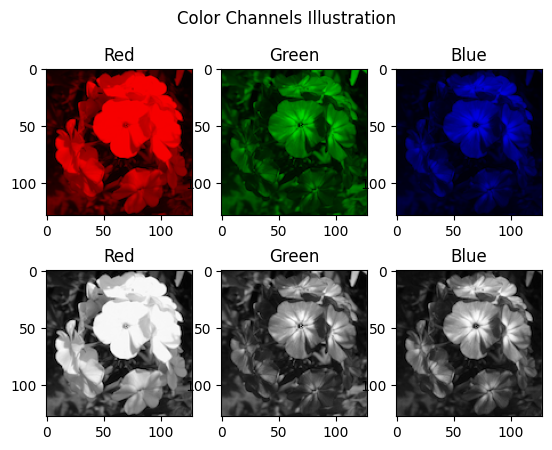
    


#### Histogram Each Channel

##### Displaying Histogram


```python
plt.suptitle('Histogram Each Channel')

plt.subplot(1,3,1)
plt.title('Red Channel')
plt.hist(sample_img[:,:,0])

plt.subplot(1,3,2)
plt.title('Green Channel')
plt.hist(sample_img[:,:,1])

plt.subplot(1,3,3)
plt.title('Blue Channel')
plt.hist(sample_img[:,:,2])
```


    (array([[86., 24., 18., ...,  0.,  0.,  0.],
            [86., 25., 17., ...,  0.,  0.,  0.],
            [86., 25., 17., ...,  0.,  0.,  0.],
            ...,
            [89., 33.,  4., ...,  0.,  0.,  0.],
            [93., 26.,  7., ...,  0.,  0.,  0.],
            [58., 47., 19., ...,  0.,  0.,  0.]]),
     array([  0. ,  23.1,  46.2,  69.3,  92.4, 115.5, 138.6, 161.7, 184.8,
            207.9, 231. ]),
     <a list of 128 BarContainer objects>)


    
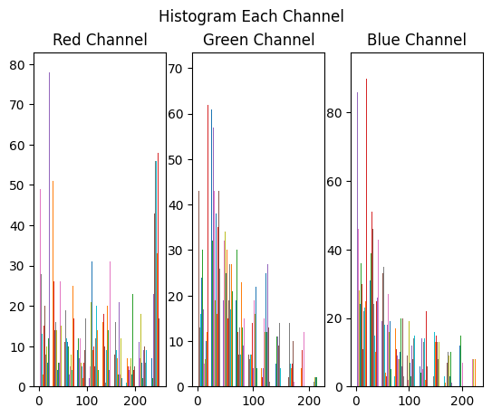
    


##### Calculating Histogram


```python
color = ['r','g','b']
all_hist = []
for i in range(3):
    hist = cv.calcHist(sample_img, [i], None, [256], [0,255])
    plt.plot(hist, color[i])
    all_hist.append(hist)
all_hist
```


    [array([[ 2.],
            [ 0.],
            [ 0.],
            [ 2.],
            [ 5.],
            [ 3.],
            [ 6.],
            [ 0.],
            [ 0.],
            [ 8.],
            [11.],
            [19.],
            [13.],
            [12.],
            [17.],
            [17.],
            [20.],
            [10.],
            [ 6.],
            [ 8.],
            [ 6.],
            [ 6.],
            [ 8.],
            [ 9.],
            [10.],
            [ 8.],
            [ 8.],
            [ 7.],
            [ 5.],
            [11.],
            [ 5.],
            [ 7.],
            [ 2.],
            [ 6.],
            [ 3.],
            [ 5.],
            [ 6.],
            [ 9.],
            [ 6.],
            [ 3.],
            [ 4.],
            [ 1.],
            [ 0.],
            [ 2.],
            [ 1.],
            [ 0.],
            [ 2.],
            [ 0.],
            [ 0.],
            [ 1.],
            [ 0.],
            [ 0.],
            [ 0.],
            [ 0.],
            [ 3.],
            [ 1.],
            [ 0.],
            [ 1.],
            [ 0.],
            [ 0.],
            [ 2.],
            [ 0.],
            [ 1.],
            [ 0.],
            [ 1.],
            [ 0.],
            [ 1.],
            [ 2.],
            [ 1.],
            [ 0.],
            [ 0.],
            [ 3.],
            [ 1.],
            [ 1.],
            [ 0.],
            [ 1.],
            [ 3.],
            [ 1.],
            [ 3.],
            [ 0.],
            [ 0.],
            [ 0.],
            [ 1.],
            [ 0.],
            [ 1.],
            [ 1.],
            [ 1.],
            [ 1.],
            [ 3.],
            [ 2.],
            [ 1.],
            [ 1.],
            [ 1.],
            [ 0.],
            [ 0.],
            [ 0.],
            [ 0.],
            [ 1.],
            [ 1.],
            [ 2.],
            [ 0.],
            [ 1.],
            [ 1.],
            [ 1.],
            [ 0.],
            [ 0.],
            [ 0.],
            [ 0.],
            [ 0.],
            [ 0.],
            [ 0.],
            [ 0.],
            [ 0.],
            [ 1.],
            [ 0.],
            [ 2.],
            [ 0.],
            [ 0.],
            [ 0.],
            [ 0.],
            [ 0.],
            [ 0.],
            [ 0.],
            [ 1.],
            [ 1.],
            [ 2.],
            [ 0.],
            [ 0.],
            [ 1.],
            [ 1.],
            [ 0.],
            [ 0.],
            [ 1.],
            [ 1.],
            [ 1.],
            [ 0.],
            [ 2.],
            [ 1.],
            [ 0.],
            [ 3.],
            [ 1.],
            [ 1.],
            [ 0.],
            [ 2.],
            [ 0.],
            [ 0.],
            [ 0.],
            [ 0.],
            [ 1.],
            [ 1.],
            [ 1.],
            [ 0.],
            [ 0.],
            [ 4.],
            [ 0.],
            [ 1.],
            [ 1.],
            [ 0.],
            [ 0.],
            [ 0.],
            [ 0.],
            [ 0.],
            [ 0.],
            [ 0.],
            [ 1.],
            [ 0.],
            [ 2.],
            [ 2.],
            [ 0.],
            [ 0.],
            [ 0.],
            [ 1.],
            [ 0.],
            [ 0.],
            [ 0.],
            [ 1.],
            [ 0.],
            [ 0.],
            [ 0.],
            [ 0.],
            [ 0.],
            [ 0.],
            [ 0.],
            [ 0.],
            [ 0.],
            [ 0.],
            [ 0.],
            [ 0.],
            [ 0.],
            [ 0.],
            [ 0.],
            [ 0.],
            [ 0.],
            [ 0.],
            [ 0.],
            [ 0.],
            [ 0.],
            [ 0.],
            [ 0.],
            [ 0.],
            [ 0.],
            [ 0.],
            [ 0.],
            [ 0.],
            [ 0.],
            [ 0.],
            [ 0.],
            [ 0.],
            [ 0.],
            [ 0.],
            [ 0.],
            [ 0.],
            [ 0.],
            [ 0.],
            [ 0.],
            [ 0.],
            [ 0.],
            [ 0.],
            [ 0.],
            [ 0.],
            [ 0.],
            [ 0.],
            [ 0.],
            [ 0.],
            [ 0.],
            [ 0.],
            [ 0.],
            [ 0.],
            [ 0.],
            [ 0.],
            [ 0.],
            [ 0.],
            [ 0.],
            [ 0.],
            [ 0.],
            [ 0.],
            [ 0.],
            [ 0.],
            [ 0.],
            [ 0.],
            [ 0.],
            [ 0.],
            [ 0.],
            [ 0.],
            [ 0.],
            [ 0.],
            [ 0.],
            [ 0.],
            [ 0.],
            [ 0.],
            [ 0.],
            [ 0.],
            [ 0.],
            [ 0.],
            [ 0.],
            [ 0.]], dtype=float32),
     array([[10.],
            [ 0.],
            [ 0.],
            [ 3.],
            [ 8.],
            [ 2.],
            [ 6.],
            [ 3.],
            [ 5.],
            [ 8.],
            [13.],
            [ 9.],
            [11.],
            [19.],
            [19.],
            [15.],
            [ 6.],
            [13.],
            [ 6.],
            [ 7.],
            [12.],
            [10.],
            [ 8.],
            [ 4.],
            [ 7.],
            [10.],
            [ 9.],
            [ 8.],
            [ 7.],
            [ 4.],
            [ 6.],
            [ 2.],
            [ 6.],
            [ 7.],
            [ 3.],
            [ 2.],
            [ 5.],
            [ 3.],
            [ 7.],
            [ 3.],
            [ 2.],
            [ 3.],
            [ 4.],
            [ 2.],
            [ 1.],
            [ 0.],
            [ 3.],
            [ 1.],
            [ 2.],
            [ 0.],
            [ 1.],
            [ 1.],
            [ 1.],
            [ 1.],
            [ 0.],
            [ 0.],
            [ 0.],
            [ 0.],
            [ 1.],
            [ 0.],
            [ 1.],
            [ 0.],
            [ 0.],
            [ 0.],
            [ 2.],
            [ 2.],
            [ 2.],
            [ 0.],
            [ 0.],
            [ 0.],
            [ 0.],
            [ 1.],
            [ 1.],
            [ 4.],
            [ 0.],
            [ 4.],
            [ 1.],
            [ 0.],
            [ 0.],
            [ 1.],
            [ 2.],
            [ 1.],
            [ 0.],
            [ 0.],
            [ 0.],
            [ 1.],
            [ 0.],
            [ 1.],
            [ 1.],
            [ 1.],
            [ 1.],
            [ 2.],
            [ 0.],
            [ 1.],
            [ 1.],
            [ 3.],
            [ 3.],
            [ 0.],
            [ 0.],
            [ 1.],
            [ 0.],
            [ 2.],
            [ 1.],
            [ 0.],
            [ 0.],
            [ 0.],
            [ 1.],
            [ 0.],
            [ 0.],
            [ 0.],
            [ 0.],
            [ 0.],
            [ 0.],
            [ 0.],
            [ 0.],
            [ 0.],
            [ 0.],
            [ 0.],
            [ 1.],
            [ 0.],
            [ 1.],
            [ 0.],
            [ 1.],
            [ 0.],
            [ 0.],
            [ 1.],
            [ 1.],
            [ 0.],
            [ 0.],
            [ 1.],
            [ 1.],
            [ 0.],
            [ 0.],
            [ 0.],
            [ 0.],
            [ 0.],
            [ 1.],
            [ 0.],
            [ 2.],
            [ 1.],
            [ 2.],
            [ 2.],
            [ 0.],
            [ 1.],
            [ 3.],
            [ 0.],
            [ 1.],
            [ 0.],
            [ 1.],
            [ 1.],
            [ 1.],
            [ 0.],
            [ 1.],
            [ 0.],
            [ 0.],
            [ 0.],
            [ 0.],
            [ 0.],
            [ 1.],
            [ 0.],
            [ 0.],
            [ 0.],
            [ 0.],
            [ 0.],
            [ 0.],
            [ 0.],
            [ 3.],
            [ 2.],
            [ 0.],
            [ 0.],
            [ 1.],
            [ 0.],
            [ 1.],
            [ 0.],
            [ 0.],
            [ 0.],
            [ 1.],
            [ 0.],
            [ 0.],
            [ 0.],
            [ 0.],
            [ 0.],
            [ 0.],
            [ 0.],
            [ 0.],
            [ 0.],
            [ 0.],
            [ 0.],
            [ 0.],
            [ 0.],
            [ 0.],
            [ 0.],
            [ 0.],
            [ 0.],
            [ 0.],
            [ 0.],
            [ 0.],
            [ 0.],
            [ 0.],
            [ 0.],
            [ 0.],
            [ 0.],
            [ 0.],
            [ 0.],
            [ 0.],
            [ 0.],
            [ 0.],
            [ 0.],
            [ 0.],
            [ 0.],
            [ 0.],
            [ 0.],
            [ 0.],
            [ 0.],
            [ 0.],
            [ 0.],
            [ 0.],
            [ 0.],
            [ 0.],
            [ 0.],
            [ 0.],
            [ 0.],
            [ 0.],
            [ 0.],
            [ 0.],
            [ 0.],
            [ 0.],
            [ 0.],
            [ 0.],
            [ 0.],
            [ 0.],
            [ 0.],
            [ 0.],
            [ 0.],
            [ 0.],
            [ 0.],
            [ 0.],
            [ 0.],
            [ 0.],
            [ 0.],
            [ 0.],
            [ 0.],
            [ 0.],
            [ 0.],
            [ 0.],
            [ 0.],
            [ 0.],
            [ 0.],
            [ 0.],
            [ 0.],
            [ 0.],
            [ 0.],
            [ 0.],
            [ 0.],
            [ 0.],
            [ 0.]], dtype=float32),
     array([[ 7.],
            [ 0.],
            [ 1.],
            [ 5.],
            [ 7.],
            [ 7.],
            [ 2.],
            [ 7.],
            [ 5.],
            [ 7.],
            [ 6.],
            [ 5.],
            [10.],
            [14.],
            [17.],
            [19.],
            [ 8.],
            [16.],
            [ 6.],
            [ 9.],
            [ 7.],
            [11.],
            [ 8.],
            [ 7.],
            [ 4.],
            [11.],
            [ 4.],
            [ 5.],
            [ 8.],
            [ 9.],
            [ 4.],
            [ 5.],
            [ 3.],
            [ 6.],
            [ 5.],
            [ 7.],
            [ 4.],
            [ 2.],
            [ 5.],
            [ 1.],
            [ 2.],
            [ 2.],
            [ 2.],
            [ 3.],
            [ 5.],
            [ 2.],
            [ 0.],
            [ 0.],
            [ 1.],
            [ 0.],
            [ 3.],
            [ 1.],
            [ 1.],
            [ 1.],
            [ 0.],
            [ 2.],
            [ 1.],
            [ 1.],
            [ 1.],
            [ 1.],
            [ 1.],
            [ 3.],
            [ 1.],
            [ 1.],
            [ 1.],
            [ 2.],
            [ 1.],
            [ 2.],
            [ 1.],
            [ 0.],
            [ 2.],
            [ 0.],
            [ 3.],
            [ 0.],
            [ 3.],
            [ 1.],
            [ 3.],
            [ 1.],
            [ 0.],
            [ 0.],
            [ 3.],
            [ 0.],
            [ 3.],
            [ 0.],
            [ 1.],
            [ 2.],
            [ 2.],
            [ 0.],
            [ 1.],
            [ 0.],
            [ 0.],
            [ 0.],
            [ 0.],
            [ 1.],
            [ 1.],
            [ 1.],
            [ 0.],
            [ 0.],
            [ 1.],
            [ 0.],
            [ 4.],
            [ 0.],
            [ 0.],
            [ 1.],
            [ 1.],
            [ 0.],
            [ 1.],
            [ 0.],
            [ 0.],
            [ 0.],
            [ 1.],
            [ 0.],
            [ 1.],
            [ 0.],
            [ 0.],
            [ 1.],
            [ 0.],
            [ 0.],
            [ 0.],
            [ 0.],
            [ 0.],
            [ 0.],
            [ 0.],
            [ 1.],
            [ 0.],
            [ 0.],
            [ 0.],
            [ 0.],
            [ 0.],
            [ 0.],
            [ 1.],
            [ 0.],
            [ 0.],
            [ 2.],
            [ 1.],
            [ 1.],
            [ 0.],
            [ 2.],
            [ 2.],
            [ 2.],
            [ 0.],
            [ 0.],
            [ 0.],
            [ 0.],
            [ 0.],
            [ 0.],
            [ 0.],
            [ 1.],
            [ 1.],
            [ 0.],
            [ 0.],
            [ 0.],
            [ 1.],
            [ 0.],
            [ 0.],
            [ 1.],
            [ 1.],
            [ 1.],
            [ 1.],
            [ 0.],
            [ 0.],
            [ 2.],
            [ 1.],
            [ 1.],
            [ 1.],
            [ 0.],
            [ 3.],
            [ 0.],
            [ 0.],
            [ 1.],
            [ 0.],
            [ 1.],
            [ 0.],
            [ 0.],
            [ 0.],
            [ 0.],
            [ 0.],
            [ 0.],
            [ 0.],
            [ 0.],
            [ 0.],
            [ 0.],
            [ 0.],
            [ 0.],
            [ 0.],
            [ 0.],
            [ 0.],
            [ 0.],
            [ 0.],
            [ 0.],
            [ 0.],
            [ 0.],
            [ 0.],
            [ 0.],
            [ 0.],
            [ 0.],
            [ 0.],
            [ 0.],
            [ 0.],
            [ 0.],
            [ 0.],
            [ 0.],
            [ 0.],
            [ 0.],
            [ 0.],
            [ 0.],
            [ 0.],
            [ 0.],
            [ 0.],
            [ 0.],
            [ 0.],
            [ 0.],
            [ 0.],
            [ 0.],
            [ 0.],
            [ 0.],
            [ 0.],
            [ 0.],
            [ 0.],
            [ 0.],
            [ 0.],
            [ 0.],
            [ 0.],
            [ 0.],
            [ 0.],
            [ 0.],
            [ 0.],
            [ 0.],
            [ 0.],
            [ 0.],
            [ 0.],
            [ 0.],
            [ 0.],
            [ 0.],
            [ 0.],
            [ 0.],
            [ 0.],
            [ 0.],
            [ 0.],
            [ 0.],
            [ 0.],
            [ 0.],
            [ 0.],
            [ 0.],
            [ 0.],
            [ 0.],
            [ 0.],
            [ 0.],
            [ 0.],
            [ 0.],
            [ 0.],
            [ 0.],
            [ 0.],
            [ 0.],
            [ 0.],
            [ 0.]], dtype=float32)]


    
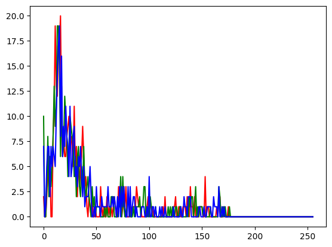
    


##### Storing Each Channel Histogram to Dataframe


```python
columns = [color+'_'+str(i) for color in ['r','g','b'] for i in range(256)]
columns.insert(0, 'file')
columns.append('label')

dataset = []
for idx, data in flower_dataset.iterrows():
    img_path = os.path.join(FLOWER_PATH,'images',data['file'])
    img = cv.imread(img_path)
    r_hist = cv.calcHist(img,[0],None, [256],[0,255]).reshape(256)
    g_hist = cv.calcHist(img,[1],None, [256],[0,255]).reshape(256)
    b_hist = cv.calcHist(img,[2],None, [256],[0,255]).reshape(256)
    hist = np.concatenate((np.array([data['file']]),r_hist, g_hist, b_hist, np.array([data['label']])))
    dataset.append(hist)
dataset = pd.DataFrame(index=flower_dataset.index, columns=columns, data=dataset)
dataset
```


<div>
<style scoped>
    .dataframe tbody tr th:only-of-type {
        vertical-align: middle;
    }

    .dataframe tbody tr th {
        vertical-align: top;
    }

    .dataframe thead th {
        text-align: right;
    }
</style>
<table border="1" class="dataframe">
  <thead>
    <tr style="text-align: right;">
      <th></th>
      <th>file</th>
      <th>r_0</th>
      <th>r_1</th>
      <th>r_2</th>
      <th>r_3</th>
      <th>r_4</th>
      <th>r_5</th>
      <th>r_6</th>
      <th>r_7</th>
      <th>r_8</th>
      <th>...</th>
      <th>b_247</th>
      <th>b_248</th>
      <th>b_249</th>
      <th>b_250</th>
      <th>b_251</th>
      <th>b_252</th>
      <th>b_253</th>
      <th>b_254</th>
      <th>b_255</th>
      <th>label</th>
    </tr>
  </thead>
  <tbody>
    <tr>
      <th>0</th>
      <td>0001.png</td>
      <td>2.0</td>
      <td>0.0</td>
      <td>0.0</td>
      <td>2.0</td>
      <td>5.0</td>
      <td>3.0</td>
      <td>6.0</td>
      <td>0.0</td>
      <td>0.0</td>
      <td>...</td>
      <td>0.0</td>
      <td>0.0</td>
      <td>0.0</td>
      <td>0.0</td>
      <td>0.0</td>
      <td>0.0</td>
      <td>0.0</td>
      <td>0.0</td>
      <td>0.0</td>
      <td>0</td>
    </tr>
    <tr>
      <th>1</th>
      <td>0002.png</td>
      <td>0.0</td>
      <td>0.0</td>
      <td>0.0</td>
      <td>0.0</td>
      <td>0.0</td>
      <td>0.0</td>
      <td>0.0</td>
      <td>0.0</td>
      <td>0.0</td>
      <td>...</td>
      <td>0.0</td>
      <td>0.0</td>
      <td>0.0</td>
      <td>0.0</td>
      <td>0.0</td>
      <td>0.0</td>
      <td>0.0</td>
      <td>0.0</td>
      <td>0.0</td>
      <td>0</td>
    </tr>
    <tr>
      <th>2</th>
      <td>0003.png</td>
      <td>0.0</td>
      <td>0.0</td>
      <td>0.0</td>
      <td>0.0</td>
      <td>0.0</td>
      <td>0.0</td>
      <td>0.0</td>
      <td>0.0</td>
      <td>0.0</td>
      <td>...</td>
      <td>0.0</td>
      <td>0.0</td>
      <td>0.0</td>
      <td>0.0</td>
      <td>0.0</td>
      <td>0.0</td>
      <td>0.0</td>
      <td>0.0</td>
      <td>0.0</td>
      <td>2</td>
    </tr>
    <tr>
      <th>3</th>
      <td>0004.png</td>
      <td>6.0</td>
      <td>0.0</td>
      <td>0.0</td>
      <td>0.0</td>
      <td>0.0</td>
      <td>0.0</td>
      <td>0.0</td>
      <td>0.0</td>
      <td>0.0</td>
      <td>...</td>
      <td>0.0</td>
      <td>0.0</td>
      <td>0.0</td>
      <td>0.0</td>
      <td>0.0</td>
      <td>0.0</td>
      <td>0.0</td>
      <td>0.0</td>
      <td>0.0</td>
      <td>0</td>
    </tr>
    <tr>
      <th>4</th>
      <td>0005.png</td>
      <td>0.0</td>
      <td>0.0</td>
      <td>0.0</td>
      <td>0.0</td>
      <td>24.0</td>
      <td>12.0</td>
      <td>13.0</td>
      <td>8.0</td>
      <td>6.0</td>
      <td>...</td>
      <td>0.0</td>
      <td>0.0</td>
      <td>0.0</td>
      <td>0.0</td>
      <td>0.0</td>
      <td>0.0</td>
      <td>0.0</td>
      <td>0.0</td>
      <td>0.0</td>
      <td>0</td>
    </tr>
    <tr>
      <th>...</th>
      <td>...</td>
      <td>...</td>
      <td>...</td>
      <td>...</td>
      <td>...</td>
      <td>...</td>
      <td>...</td>
      <td>...</td>
      <td>...</td>
      <td>...</td>
      <td>...</td>
      <td>...</td>
      <td>...</td>
      <td>...</td>
      <td>...</td>
      <td>...</td>
      <td>...</td>
      <td>...</td>
      <td>...</td>
      <td>...</td>
      <td>...</td>
    </tr>
    <tr>
      <th>205</th>
      <td>0206.png</td>
      <td>9.0</td>
      <td>0.0</td>
      <td>0.0</td>
      <td>1.0</td>
      <td>0.0</td>
      <td>0.0</td>
      <td>0.0</td>
      <td>0.0</td>
      <td>0.0</td>
      <td>...</td>
      <td>1.0</td>
      <td>1.0</td>
      <td>0.0</td>
      <td>0.0</td>
      <td>0.0</td>
      <td>3.0</td>
      <td>1.0</td>
      <td>0.0</td>
      <td>0.0</td>
      <td>6</td>
    </tr>
    <tr>
      <th>206</th>
      <td>0207.png</td>
      <td>0.0</td>
      <td>0.0</td>
      <td>0.0</td>
      <td>0.0</td>
      <td>17.0</td>
      <td>56.0</td>
      <td>65.0</td>
      <td>43.0</td>
      <td>31.0</td>
      <td>...</td>
      <td>0.0</td>
      <td>0.0</td>
      <td>0.0</td>
      <td>0.0</td>
      <td>0.0</td>
      <td>0.0</td>
      <td>0.0</td>
      <td>0.0</td>
      <td>0.0</td>
      <td>0</td>
    </tr>
    <tr>
      <th>207</th>
      <td>0208.png</td>
      <td>1.0</td>
      <td>54.0</td>
      <td>65.0</td>
      <td>69.0</td>
      <td>64.0</td>
      <td>66.0</td>
      <td>33.0</td>
      <td>16.0</td>
      <td>5.0</td>
      <td>...</td>
      <td>0.0</td>
      <td>0.0</td>
      <td>0.0</td>
      <td>0.0</td>
      <td>0.0</td>
      <td>0.0</td>
      <td>0.0</td>
      <td>0.0</td>
      <td>0.0</td>
      <td>4</td>
    </tr>
    <tr>
      <th>208</th>
      <td>0209.png</td>
      <td>0.0</td>
      <td>0.0</td>
      <td>0.0</td>
      <td>0.0</td>
      <td>0.0</td>
      <td>0.0</td>
      <td>0.0</td>
      <td>0.0</td>
      <td>0.0</td>
      <td>...</td>
      <td>0.0</td>
      <td>0.0</td>
      <td>0.0</td>
      <td>0.0</td>
      <td>0.0</td>
      <td>0.0</td>
      <td>0.0</td>
      <td>0.0</td>
      <td>0.0</td>
      <td>6</td>
    </tr>
    <tr>
      <th>209</th>
      <td>0210.png</td>
      <td>0.0</td>
      <td>0.0</td>
      <td>0.0</td>
      <td>0.0</td>
      <td>0.0</td>
      <td>0.0</td>
      <td>0.0</td>
      <td>0.0</td>
      <td>1.0</td>
      <td>...</td>
      <td>0.0</td>
      <td>0.0</td>
      <td>0.0</td>
      <td>0.0</td>
      <td>0.0</td>
      <td>0.0</td>
      <td>0.0</td>
      <td>0.0</td>
      <td>0.0</td>
      <td>1</td>
    </tr>
  </tbody>
</table>
<p>210 rows × 770 columns</p>
</div>


```python
dataset.to_csv('flower_dataset_histogram_rgb.csv', index=False)
```

##### Statistic in Histogram


```python
all_hist = [cv.calcHist(img, channels=[0], mask=None, histSize=[256],ranges=[0,255]).reshape(256),cv.calcHist(img, channels=[1], mask=None, histSize=[256],ranges=[0,255]).reshape(256),cv.calcHist(img, channels=[2], mask=None, histSize=[256],ranges=[0,255]).reshape(256)]
hist_red_stats, hist_green_stats, hist_blue_stats = stats.describe(all_hist[0]), stats.describe(all_hist[1]), stats.describe(all_hist[2])
hist_red_stats, hist_green_stats, hist_blue_stats
```


    (DescribeResult(nobs=256, minmax=(0.0, 10.0), mean=1.5, variance=4.0627450980392155, skewness=1.6726602349653925, kurtosis=2.8727806681474632),
     DescribeResult(nobs=256, minmax=(0.0, 12.0), mean=1.5, variance=4.305882352941176, skewness=1.914278579347095, kurtosis=4.483133765315975),
     DescribeResult(nobs=256, minmax=(0.0, 9.0), mean=1.5, variance=4.125490196078431, skewness=1.5192924621820472, kurtosis=1.7332186384073793))


```python
hist_red_stat = {}
hist_red_stat['mean'] = np.mean(all_hist[0])
hist_red_stat['max'] = np.max(all_hist[0])
hist_red_stat['min'] = np.min(all_hist[0])
hist_red_stat['std'] = np.std(all_hist[0])
hist_red_stat['var'] = np.var(all_hist[0])
hist_red_stat
```


    {'mean': 1.92, 'max': 29.0, 'min': 0.0, 'std': 4.260704, 'var': 18.1536}


```python
stats.describe(all_hist[0])
```


    DescribeResult(nobs=256, minmax=(0.0, 10.0), mean=1.5, variance=4.0627450980392155, skewness=1.6726602349653925, kurtosis=2.8727806681474632)


```python
from IPython.display import display

columns = [color+'_'+str(i) for color in ['r','g','b'] for i in ['mean', 'std', 'var', 'kurtosis', 'skewness']]
columns.insert(0, 'file')
columns.append('label')

dataset = []
for idx, row in flower_dataset.iterrows():
    img_path = os.path.join(FLOWER_PATH,'images',row['file'])
    img = cv.imread(img_path)
    tmp = [row['file']]
    for color in range(3):
        hist = cv.calcHist(img, channels=[color], mask=None, histSize=[256],ranges=[0,255]).reshape(256)
        hist_stats = stats.describe(hist)
        tmp.append(hist_stats[2])
        tmp.append(np.std(hist))
        tmp.append(hist_stats[3])
        tmp.append(hist_stats[4])
        tmp.append(hist_stats[5])
    tmp.append(row['label'])
    
    dataset.append(tmp)
dataset = pd.DataFrame(index=flower_dataset.index, columns=columns, data=dataset)
display(dataset)
dataset.to_csv('flower_dataset_hist_stats_rgb.csv', index=False)
```


<div>
<style scoped>
    .dataframe tbody tr th:only-of-type {
        vertical-align: middle;
    }

    .dataframe tbody tr th {
        vertical-align: top;
    }

    .dataframe thead th {
        text-align: right;
    }
</style>
<table border="1" class="dataframe">
  <thead>
    <tr style="text-align: right;">
      <th></th>
      <th>file</th>
      <th>r_mean</th>
      <th>r_std</th>
      <th>r_var</th>
      <th>r_kurtosis</th>
      <th>r_skewness</th>
      <th>g_mean</th>
      <th>g_std</th>
      <th>g_var</th>
      <th>g_kurtosis</th>
      <th>g_skewness</th>
      <th>b_mean</th>
      <th>b_std</th>
      <th>b_var</th>
      <th>b_kurtosis</th>
      <th>b_skewness</th>
      <th>label</th>
    </tr>
  </thead>
  <tbody>
    <tr>
      <th>0</th>
      <td>0001.png</td>
      <td>1.5000</td>
      <td>3.228293</td>
      <td>10.462745</td>
      <td>3.210696</td>
      <td>11.536875</td>
      <td>1.5000</td>
      <td>3.094855</td>
      <td>9.615686</td>
      <td>3.029024</td>
      <td>10.334235</td>
      <td>1.5000</td>
      <td>2.935505</td>
      <td>8.650980</td>
      <td>3.033020</td>
      <td>10.891306</td>
      <td>0</td>
    </tr>
    <tr>
      <th>1</th>
      <td>0002.png</td>
      <td>1.5000</td>
      <td>2.361805</td>
      <td>5.600000</td>
      <td>1.972925</td>
      <td>3.739260</td>
      <td>1.5000</td>
      <td>2.148764</td>
      <td>4.635294</td>
      <td>1.593408</td>
      <td>2.106170</td>
      <td>1.5000</td>
      <td>2.034853</td>
      <td>4.156863</td>
      <td>1.221172</td>
      <td>0.387056</td>
      <td>0</td>
    </tr>
    <tr>
      <th>2</th>
      <td>0003.png</td>
      <td>1.5000</td>
      <td>2.504683</td>
      <td>6.298039</td>
      <td>1.942811</td>
      <td>4.092209</td>
      <td>1.5000</td>
      <td>2.482753</td>
      <td>6.188235</td>
      <td>1.752776</td>
      <td>2.411904</td>
      <td>1.5000</td>
      <td>2.642797</td>
      <td>7.011765</td>
      <td>1.811941</td>
      <td>2.366245</td>
      <td>2</td>
    </tr>
    <tr>
      <th>3</th>
      <td>0004.png</td>
      <td>1.5000</td>
      <td>1.518120</td>
      <td>2.313725</td>
      <td>1.008161</td>
      <td>0.608710</td>
      <td>1.5000</td>
      <td>1.518120</td>
      <td>2.313725</td>
      <td>0.988064</td>
      <td>0.820511</td>
      <td>1.5000</td>
      <td>1.648863</td>
      <td>2.729412</td>
      <td>1.233870</td>
      <td>1.432818</td>
      <td>0</td>
    </tr>
    <tr>
      <th>4</th>
      <td>0005.png</td>
      <td>1.5000</td>
      <td>2.868198</td>
      <td>8.258824</td>
      <td>3.499919</td>
      <td>17.448492</td>
      <td>1.5000</td>
      <td>2.776857</td>
      <td>7.741176</td>
      <td>3.509795</td>
      <td>16.263877</td>
      <td>1.5000</td>
      <td>2.806243</td>
      <td>7.905882</td>
      <td>3.243194</td>
      <td>12.879063</td>
      <td>0</td>
    </tr>
    <tr>
      <th>...</th>
      <td>...</td>
      <td>...</td>
      <td>...</td>
      <td>...</td>
      <td>...</td>
      <td>...</td>
      <td>...</td>
      <td>...</td>
      <td>...</td>
      <td>...</td>
      <td>...</td>
      <td>...</td>
      <td>...</td>
      <td>...</td>
      <td>...</td>
      <td>...</td>
      <td>...</td>
    </tr>
    <tr>
      <th>205</th>
      <td>0206.png</td>
      <td>1.5000</td>
      <td>1.938508</td>
      <td>3.772549</td>
      <td>1.858064</td>
      <td>4.556537</td>
      <td>1.5000</td>
      <td>1.858259</td>
      <td>3.466667</td>
      <td>1.742253</td>
      <td>4.501239</td>
      <td>1.5000</td>
      <td>1.804941</td>
      <td>3.270588</td>
      <td>1.875348</td>
      <td>4.356969</td>
      <td>6</td>
    </tr>
    <tr>
      <th>206</th>
      <td>0207.png</td>
      <td>1.5000</td>
      <td>6.852805</td>
      <td>47.145098</td>
      <td>6.648915</td>
      <td>49.114877</td>
      <td>1.5000</td>
      <td>6.697714</td>
      <td>45.035294</td>
      <td>6.806078</td>
      <td>51.601987</td>
      <td>1.5000</td>
      <td>6.655003</td>
      <td>44.462745</td>
      <td>6.921304</td>
      <td>53.470920</td>
      <td>0</td>
    </tr>
    <tr>
      <th>207</th>
      <td>0208.png</td>
      <td>2.4375</td>
      <td>9.155983</td>
      <td>84.160784</td>
      <td>6.100672</td>
      <td>37.931384</td>
      <td>2.4375</td>
      <td>9.523204</td>
      <td>91.047059</td>
      <td>6.455634</td>
      <td>45.428669</td>
      <td>2.4375</td>
      <td>10.412020</td>
      <td>108.835294</td>
      <td>6.898248</td>
      <td>49.472767</td>
      <td>4</td>
    </tr>
    <tr>
      <th>208</th>
      <td>0209.png</td>
      <td>1.5000</td>
      <td>2.584509</td>
      <td>6.705882</td>
      <td>1.928494</td>
      <td>3.272223</td>
      <td>1.5000</td>
      <td>2.399544</td>
      <td>5.780392</td>
      <td>1.731163</td>
      <td>2.266987</td>
      <td>1.5000</td>
      <td>2.216769</td>
      <td>4.933333</td>
      <td>1.754584</td>
      <td>3.188560</td>
      <td>6</td>
    </tr>
    <tr>
      <th>209</th>
      <td>0210.png</td>
      <td>1.5000</td>
      <td>2.011685</td>
      <td>4.062745</td>
      <td>1.672660</td>
      <td>2.872781</td>
      <td>1.5000</td>
      <td>2.071005</td>
      <td>4.305882</td>
      <td>1.914279</td>
      <td>4.483134</td>
      <td>1.5000</td>
      <td>2.027159</td>
      <td>4.125490</td>
      <td>1.519292</td>
      <td>1.733219</td>
      <td>1</td>
    </tr>
  </tbody>
</table>
<p>210 rows × 17 columns</p>
</div>


#### Classification

##### Classification Using Histogram


```python
flower_histogram = pd.read_csv('flower_dataset_histogram_rgb.csv')
flower_histogram
```


<div>
<style scoped>
    .dataframe tbody tr th:only-of-type {
        vertical-align: middle;
    }

    .dataframe tbody tr th {
        vertical-align: top;
    }

    .dataframe thead th {
        text-align: right;
    }
</style>
<table border="1" class="dataframe">
  <thead>
    <tr style="text-align: right;">
      <th></th>
      <th>file</th>
      <th>r_0</th>
      <th>r_1</th>
      <th>r_2</th>
      <th>r_3</th>
      <th>r_4</th>
      <th>r_5</th>
      <th>r_6</th>
      <th>r_7</th>
      <th>r_8</th>
      <th>...</th>
      <th>b_247</th>
      <th>b_248</th>
      <th>b_249</th>
      <th>b_250</th>
      <th>b_251</th>
      <th>b_252</th>
      <th>b_253</th>
      <th>b_254</th>
      <th>b_255</th>
      <th>label</th>
    </tr>
  </thead>
  <tbody>
    <tr>
      <th>0</th>
      <td>0001.png</td>
      <td>2.0</td>
      <td>0.0</td>
      <td>0.0</td>
      <td>2.0</td>
      <td>5.0</td>
      <td>3.0</td>
      <td>6.0</td>
      <td>0.0</td>
      <td>0.0</td>
      <td>...</td>
      <td>0.0</td>
      <td>0.0</td>
      <td>0.0</td>
      <td>0.0</td>
      <td>0.0</td>
      <td>0.0</td>
      <td>0.0</td>
      <td>0.0</td>
      <td>0.0</td>
      <td>0</td>
    </tr>
    <tr>
      <th>1</th>
      <td>0002.png</td>
      <td>0.0</td>
      <td>0.0</td>
      <td>0.0</td>
      <td>0.0</td>
      <td>0.0</td>
      <td>0.0</td>
      <td>0.0</td>
      <td>0.0</td>
      <td>0.0</td>
      <td>...</td>
      <td>0.0</td>
      <td>0.0</td>
      <td>0.0</td>
      <td>0.0</td>
      <td>0.0</td>
      <td>0.0</td>
      <td>0.0</td>
      <td>0.0</td>
      <td>0.0</td>
      <td>0</td>
    </tr>
    <tr>
      <th>2</th>
      <td>0003.png</td>
      <td>0.0</td>
      <td>0.0</td>
      <td>0.0</td>
      <td>0.0</td>
      <td>0.0</td>
      <td>0.0</td>
      <td>0.0</td>
      <td>0.0</td>
      <td>0.0</td>
      <td>...</td>
      <td>0.0</td>
      <td>0.0</td>
      <td>0.0</td>
      <td>0.0</td>
      <td>0.0</td>
      <td>0.0</td>
      <td>0.0</td>
      <td>0.0</td>
      <td>0.0</td>
      <td>2</td>
    </tr>
    <tr>
      <th>3</th>
      <td>0004.png</td>
      <td>6.0</td>
      <td>0.0</td>
      <td>0.0</td>
      <td>0.0</td>
      <td>0.0</td>
      <td>0.0</td>
      <td>0.0</td>
      <td>0.0</td>
      <td>0.0</td>
      <td>...</td>
      <td>0.0</td>
      <td>0.0</td>
      <td>0.0</td>
      <td>0.0</td>
      <td>0.0</td>
      <td>0.0</td>
      <td>0.0</td>
      <td>0.0</td>
      <td>0.0</td>
      <td>0</td>
    </tr>
    <tr>
      <th>4</th>
      <td>0005.png</td>
      <td>0.0</td>
      <td>0.0</td>
      <td>0.0</td>
      <td>0.0</td>
      <td>24.0</td>
      <td>12.0</td>
      <td>13.0</td>
      <td>8.0</td>
      <td>6.0</td>
      <td>...</td>
      <td>0.0</td>
      <td>0.0</td>
      <td>0.0</td>
      <td>0.0</td>
      <td>0.0</td>
      <td>0.0</td>
      <td>0.0</td>
      <td>0.0</td>
      <td>0.0</td>
      <td>0</td>
    </tr>
    <tr>
      <th>...</th>
      <td>...</td>
      <td>...</td>
      <td>...</td>
      <td>...</td>
      <td>...</td>
      <td>...</td>
      <td>...</td>
      <td>...</td>
      <td>...</td>
      <td>...</td>
      <td>...</td>
      <td>...</td>
      <td>...</td>
      <td>...</td>
      <td>...</td>
      <td>...</td>
      <td>...</td>
      <td>...</td>
      <td>...</td>
      <td>...</td>
      <td>...</td>
    </tr>
    <tr>
      <th>205</th>
      <td>0206.png</td>
      <td>9.0</td>
      <td>0.0</td>
      <td>0.0</td>
      <td>1.0</td>
      <td>0.0</td>
      <td>0.0</td>
      <td>0.0</td>
      <td>0.0</td>
      <td>0.0</td>
      <td>...</td>
      <td>1.0</td>
      <td>1.0</td>
      <td>0.0</td>
      <td>0.0</td>
      <td>0.0</td>
      <td>3.0</td>
      <td>1.0</td>
      <td>0.0</td>
      <td>0.0</td>
      <td>6</td>
    </tr>
    <tr>
      <th>206</th>
      <td>0207.png</td>
      <td>0.0</td>
      <td>0.0</td>
      <td>0.0</td>
      <td>0.0</td>
      <td>17.0</td>
      <td>56.0</td>
      <td>65.0</td>
      <td>43.0</td>
      <td>31.0</td>
      <td>...</td>
      <td>0.0</td>
      <td>0.0</td>
      <td>0.0</td>
      <td>0.0</td>
      <td>0.0</td>
      <td>0.0</td>
      <td>0.0</td>
      <td>0.0</td>
      <td>0.0</td>
      <td>0</td>
    </tr>
    <tr>
      <th>207</th>
      <td>0208.png</td>
      <td>1.0</td>
      <td>54.0</td>
      <td>65.0</td>
      <td>69.0</td>
      <td>64.0</td>
      <td>66.0</td>
      <td>33.0</td>
      <td>16.0</td>
      <td>5.0</td>
      <td>...</td>
      <td>0.0</td>
      <td>0.0</td>
      <td>0.0</td>
      <td>0.0</td>
      <td>0.0</td>
      <td>0.0</td>
      <td>0.0</td>
      <td>0.0</td>
      <td>0.0</td>
      <td>4</td>
    </tr>
    <tr>
      <th>208</th>
      <td>0209.png</td>
      <td>0.0</td>
      <td>0.0</td>
      <td>0.0</td>
      <td>0.0</td>
      <td>0.0</td>
      <td>0.0</td>
      <td>0.0</td>
      <td>0.0</td>
      <td>0.0</td>
      <td>...</td>
      <td>0.0</td>
      <td>0.0</td>
      <td>0.0</td>
      <td>0.0</td>
      <td>0.0</td>
      <td>0.0</td>
      <td>0.0</td>
      <td>0.0</td>
      <td>0.0</td>
      <td>6</td>
    </tr>
    <tr>
      <th>209</th>
      <td>0210.png</td>
      <td>0.0</td>
      <td>0.0</td>
      <td>0.0</td>
      <td>0.0</td>
      <td>0.0</td>
      <td>0.0</td>
      <td>0.0</td>
      <td>0.0</td>
      <td>1.0</td>
      <td>...</td>
      <td>0.0</td>
      <td>0.0</td>
      <td>0.0</td>
      <td>0.0</td>
      <td>0.0</td>
      <td>0.0</td>
      <td>0.0</td>
      <td>0.0</td>
      <td>0.0</td>
      <td>1</td>
    </tr>
  </tbody>
</table>
<p>210 rows × 770 columns</p>
</div>


```python
import seaborn as sns
from sklearn.tree import DecisionTreeClassifier
from sklearn.model_selection import train_test_split
from sklearn.metrics import confusion_matrix, accuracy_score, f1_score

x_train, x_test, y_train, y_test = train_test_split(flower_histogram.iloc[:, 1:-1],flower_histogram.iloc[:,-1], test_size=0.3, random_state=99, shuffle=True)

model = DecisionTreeClassifier()
model.fit(x_train, y_train)
y_predict = model.predict(x_test)

labels_name = ['phlox','rose', 'calendu', 'iris','leucanthem','campanula','viola','rudbeckia','peony','aquilegia']
cm = confusion_matrix(y_pred=y_predict, y_true=y_test)
cm = pd.DataFrame(index=labels_name, columns=labels_name, data=cm)
sns.heatmap(data=cm, annot=True).set_title('Confusion Matrix')

accuracy = round(accuracy_score(y_pred=y_predict, y_true=y_test)*100,2)
print('Accuracy: ',accuracy,'%')

f1_score = round(f1_score(y_pred=y_predict, y_true=y_test, average='weighted')*100,2)
print('F1-score: ',f1_score,'%')
```

    Accuracy:  19.05 %
    F1-score:  15.28 %


    
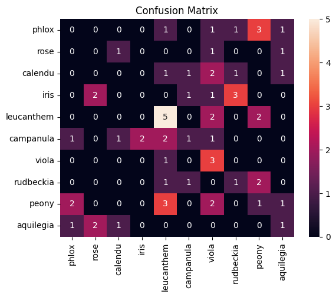
    


##### Classification Using Statistic of Histrogram


```python
flower_stats = pd.read_csv('flower_dataset_hist_stats_rgb.csv')
flower_stats
```


<div>
<style scoped>
    .dataframe tbody tr th:only-of-type {
        vertical-align: middle;
    }

    .dataframe tbody tr th {
        vertical-align: top;
    }

    .dataframe thead th {
        text-align: right;
    }
</style>
<table border="1" class="dataframe">
  <thead>
    <tr style="text-align: right;">
      <th></th>
      <th>file</th>
      <th>r_mean</th>
      <th>r_std</th>
      <th>r_var</th>
      <th>r_kurtosis</th>
      <th>r_skewness</th>
      <th>g_mean</th>
      <th>g_std</th>
      <th>g_var</th>
      <th>g_kurtosis</th>
      <th>g_skewness</th>
      <th>b_mean</th>
      <th>b_std</th>
      <th>b_var</th>
      <th>b_kurtosis</th>
      <th>b_skewness</th>
      <th>label</th>
    </tr>
  </thead>
  <tbody>
    <tr>
      <th>0</th>
      <td>0001.png</td>
      <td>1.5000</td>
      <td>3.228293</td>
      <td>10.462745</td>
      <td>3.210696</td>
      <td>11.536875</td>
      <td>1.5000</td>
      <td>3.094855</td>
      <td>9.615686</td>
      <td>3.029024</td>
      <td>10.334235</td>
      <td>1.5000</td>
      <td>2.935505</td>
      <td>8.650980</td>
      <td>3.033020</td>
      <td>10.891306</td>
      <td>0</td>
    </tr>
    <tr>
      <th>1</th>
      <td>0002.png</td>
      <td>1.5000</td>
      <td>2.361805</td>
      <td>5.600000</td>
      <td>1.972925</td>
      <td>3.739260</td>
      <td>1.5000</td>
      <td>2.148764</td>
      <td>4.635294</td>
      <td>1.593408</td>
      <td>2.106170</td>
      <td>1.5000</td>
      <td>2.034852</td>
      <td>4.156863</td>
      <td>1.221172</td>
      <td>0.387056</td>
      <td>0</td>
    </tr>
    <tr>
      <th>2</th>
      <td>0003.png</td>
      <td>1.5000</td>
      <td>2.504683</td>
      <td>6.298039</td>
      <td>1.942811</td>
      <td>4.092209</td>
      <td>1.5000</td>
      <td>2.482753</td>
      <td>6.188235</td>
      <td>1.752776</td>
      <td>2.411904</td>
      <td>1.5000</td>
      <td>2.642797</td>
      <td>7.011765</td>
      <td>1.811941</td>
      <td>2.366245</td>
      <td>2</td>
    </tr>
    <tr>
      <th>3</th>
      <td>0004.png</td>
      <td>1.5000</td>
      <td>1.518120</td>
      <td>2.313725</td>
      <td>1.008161</td>
      <td>0.608710</td>
      <td>1.5000</td>
      <td>1.518120</td>
      <td>2.313725</td>
      <td>0.988064</td>
      <td>0.820511</td>
      <td>1.5000</td>
      <td>1.648863</td>
      <td>2.729412</td>
      <td>1.233870</td>
      <td>1.432818</td>
      <td>0</td>
    </tr>
    <tr>
      <th>4</th>
      <td>0005.png</td>
      <td>1.5000</td>
      <td>2.868198</td>
      <td>8.258824</td>
      <td>3.499919</td>
      <td>17.448492</td>
      <td>1.5000</td>
      <td>2.776857</td>
      <td>7.741176</td>
      <td>3.509795</td>
      <td>16.263877</td>
      <td>1.5000</td>
      <td>2.806243</td>
      <td>7.905882</td>
      <td>3.243194</td>
      <td>12.879063</td>
      <td>0</td>
    </tr>
    <tr>
      <th>...</th>
      <td>...</td>
      <td>...</td>
      <td>...</td>
      <td>...</td>
      <td>...</td>
      <td>...</td>
      <td>...</td>
      <td>...</td>
      <td>...</td>
      <td>...</td>
      <td>...</td>
      <td>...</td>
      <td>...</td>
      <td>...</td>
      <td>...</td>
      <td>...</td>
      <td>...</td>
    </tr>
    <tr>
      <th>205</th>
      <td>0206.png</td>
      <td>1.5000</td>
      <td>1.938508</td>
      <td>3.772549</td>
      <td>1.858064</td>
      <td>4.556537</td>
      <td>1.5000</td>
      <td>1.858259</td>
      <td>3.466667</td>
      <td>1.742253</td>
      <td>4.501239</td>
      <td>1.5000</td>
      <td>1.804941</td>
      <td>3.270588</td>
      <td>1.875348</td>
      <td>4.356969</td>
      <td>6</td>
    </tr>
    <tr>
      <th>206</th>
      <td>0207.png</td>
      <td>1.5000</td>
      <td>6.852805</td>
      <td>47.145098</td>
      <td>6.648915</td>
      <td>49.114877</td>
      <td>1.5000</td>
      <td>6.697714</td>
      <td>45.035294</td>
      <td>6.806078</td>
      <td>51.601987</td>
      <td>1.5000</td>
      <td>6.655003</td>
      <td>44.462745</td>
      <td>6.921304</td>
      <td>53.470920</td>
      <td>0</td>
    </tr>
    <tr>
      <th>207</th>
      <td>0208.png</td>
      <td>2.4375</td>
      <td>9.155983</td>
      <td>84.160784</td>
      <td>6.100672</td>
      <td>37.931384</td>
      <td>2.4375</td>
      <td>9.523204</td>
      <td>91.047059</td>
      <td>6.455634</td>
      <td>45.428669</td>
      <td>2.4375</td>
      <td>10.412020</td>
      <td>108.835294</td>
      <td>6.898248</td>
      <td>49.472767</td>
      <td>4</td>
    </tr>
    <tr>
      <th>208</th>
      <td>0209.png</td>
      <td>1.5000</td>
      <td>2.584509</td>
      <td>6.705882</td>
      <td>1.928494</td>
      <td>3.272223</td>
      <td>1.5000</td>
      <td>2.399544</td>
      <td>5.780392</td>
      <td>1.731163</td>
      <td>2.266987</td>
      <td>1.5000</td>
      <td>2.216769</td>
      <td>4.933333</td>
      <td>1.754584</td>
      <td>3.188560</td>
      <td>6</td>
    </tr>
    <tr>
      <th>209</th>
      <td>0210.png</td>
      <td>1.5000</td>
      <td>2.011685</td>
      <td>4.062745</td>
      <td>1.672660</td>
      <td>2.872781</td>
      <td>1.5000</td>
      <td>2.071005</td>
      <td>4.305882</td>
      <td>1.914279</td>
      <td>4.483134</td>
      <td>1.5000</td>
      <td>2.027159</td>
      <td>4.125490</td>
      <td>1.519292</td>
      <td>1.733219</td>
      <td>1</td>
    </tr>
  </tbody>
</table>
<p>210 rows × 17 columns</p>
</div>


```python
import seaborn as sns
from sklearn.tree import DecisionTreeClassifier
from sklearn.model_selection import train_test_split
from sklearn.metrics import confusion_matrix, accuracy_score, f1_score

x_train, x_test, y_train, y_test = train_test_split(flower_stats.iloc[:, 1:-1],flower_stats.iloc[:,-1], test_size=0.3, random_state=99, shuffle=True)

model = DecisionTreeClassifier()
model.fit(x_train, y_train)
y_predict = model.predict(x_test)

labels_name = ['phlox','rose', 'calendu', 'iris','leucanthem','campanula','viola','rudbeckia','peony','aquilegia']
cm = confusion_matrix(y_pred=y_predict, y_true=y_test)
cm = pd.DataFrame(index=labels_name, columns=labels_name, data=cm)
sns.heatmap(data=cm, annot=True).set_title('Confusion Matrix')

accuracy = round(accuracy_score(y_pred=y_predict, y_true=y_test)*100,2)
print('Accuracy: ',accuracy,'%')

f1_score = round(f1_score(y_pred=y_predict, y_true=y_test, average='weighted')*100,2)
print('F1-score: ',f1_score,'%')
```

    Accuracy:  34.92 %
    F1-score:  33.44 %


    
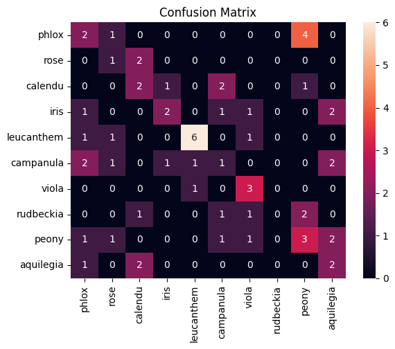
    


# What should  we  do to improve the accuracy?


